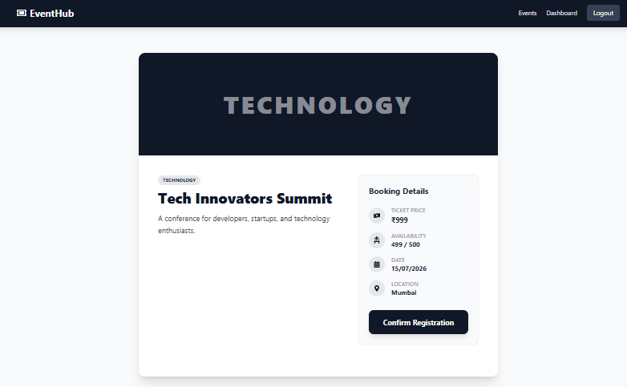
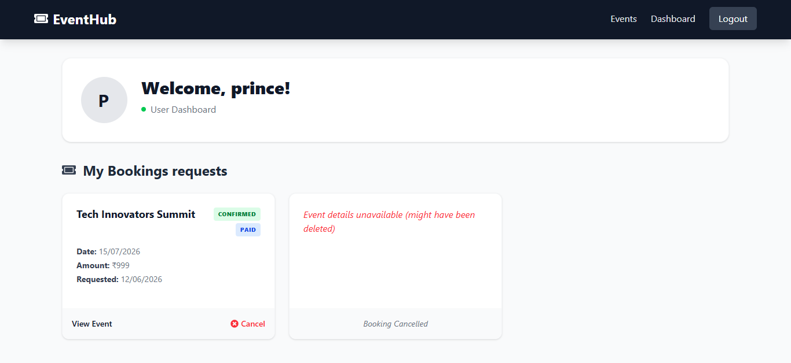
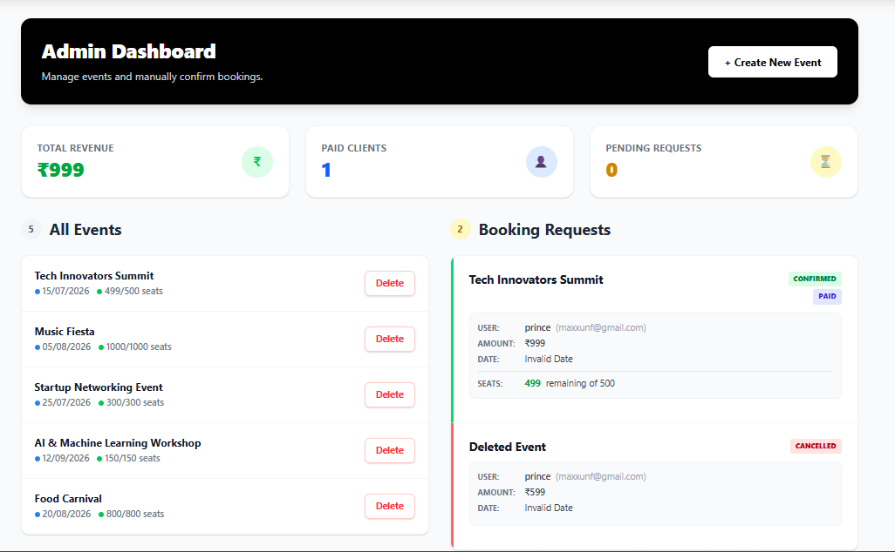

# 🎟️ EventHub - Event booking System

EventHub is a full-stack event management platform that allows users to browse events, register for events, and manage their bookings. Administrators can create, manage, and monitor events while tracking booking requests and revenue in real time.

---

## 🚀 Features

### 👤 User Features
- User Registration & Login
- Secure Authentication using JWT
- Browse Upcoming Events
- Search Events by Title
- View Event Details
- Book Event Tickets
- Cancel Bookings
- User Dashboard

### 🛠️ Admin Features
- Admin Dashboard
- Create New Events
- Delete Events
- View Booking Requests
- Confirm or Reject Registrations
- Revenue Tracking
- Monitor Available Seats
- Manage Event Participants

## 🛠️ Tech Stack

| Category | Technologies |
|-----------|-------------|
| Frontend | React.js, Vite, Tailwind CSS, React Router DOM, Axios |
| Backend | Node.js, Express.js |
| Database | MongoDB Atlas, Mongoose |
| Authentication | JWT (JSON Web Token), bcrypt.js |


## 📂 Project Structure

```bash
eventHub/
│
├── client/
│   ├── src/
│   ├── public/
│   └── package.json
│
├── server/
│   ├── controllers/
│   ├── middleware/
│   ├── models/
│   ├── routes/
│   ├── utils/
│   ├── index.js
│   └── package.json
│
└── README.md
```

---

## 📸 Screenshots

### 🏠 Home Page


---

### 📅 Upcoming Events


---

### 🎫 Event Details



---

### 👤 User Dashboard



---

### 🛠️ Admin Dashboard



## 🚀 Features

### 👤 User Features
- User Registration & Login
- Email OTP Verification during Signup
- Secure JWT Authentication
- Browse Upcoming Events
- Search Events by Title
- View Event Details
- Event Registration with Email OTP Confirmation
- Booking Status Tracking
- Booking Cancellation
- User Dashboard

### 📧 Email Notification System
- Signup OTP Verification
- Booking Confirmation OTP
- Secure Email-Based Authentication
- Automated Email Notifications

### 🛠️ Admin Features
- Create New Events
- Delete Events
- Manage Booking Requests
- Confirm or Reject Registrations
- Revenue Monitoring
- Seat Availability Management


---


## ⭐ Support

If you found this project useful, please consider giving it a ⭐ on GitHub.
